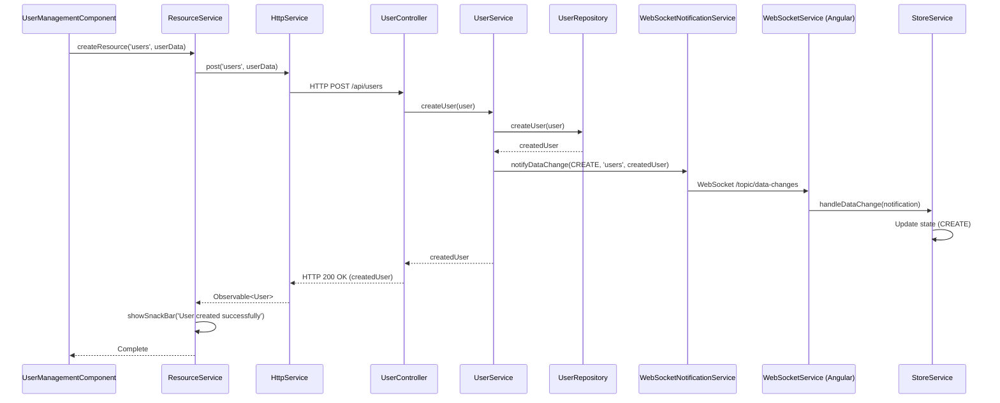
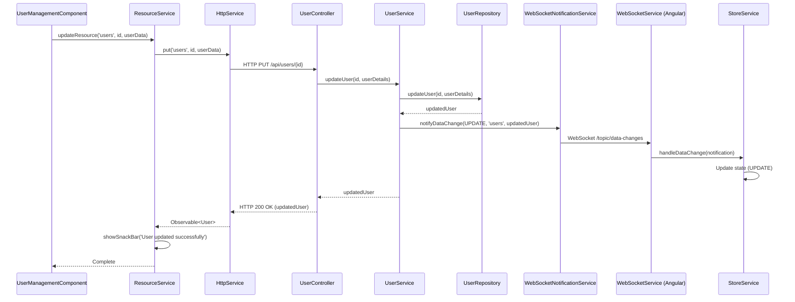
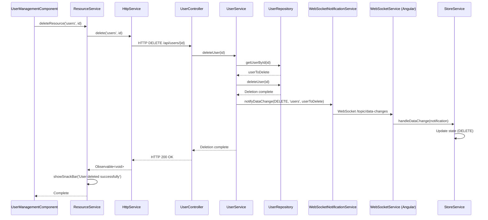
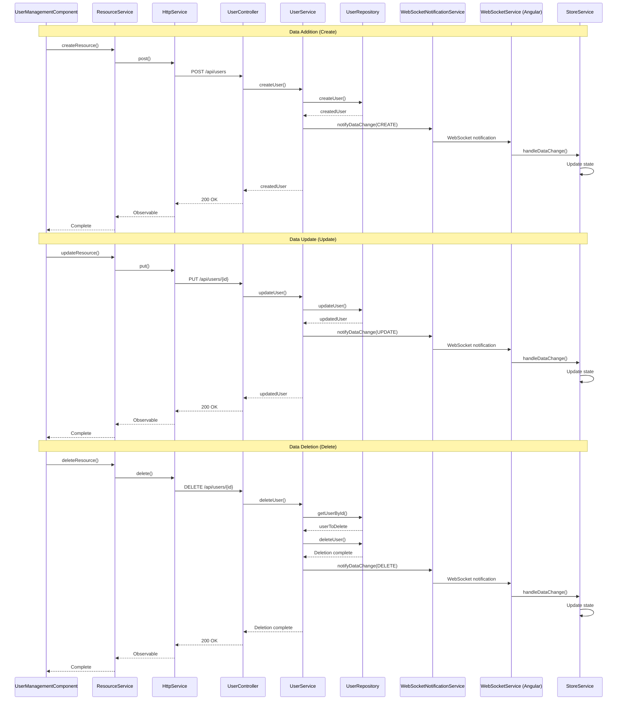

# User Management System

A user management system built with Spring Boot backend and Angular frontend.

## Overview

This system is a web application for managing user information (first name, last name, email address, and JSON data). The backend is built with Spring Boot and the frontend is built with Angular. Data is managed using a JSON file-based database.

## System Architecture

### Backend (Spring Boot)

- **Framework**: Spring Boot 3.x
- **Database**: File-based JSONDB (migrated from H2)
- **Build Tool**: Gradle
- **Java Version**: 17+

#### Main Components

- **User Entity**: Entity class representing user information
- **JsonDbService**: Handles JSON file-based database operations
- **UserService**: Handles business logic
- **UserController**: Provides REST API endpoints
- **IndexController**: Provides web pages and status information

#### Data Structure

```json
{
  "id": "1",
  "firstName": "Taro",
  "lastName": "Tanaka",
  "email": "tanaka@example.com",
  "jsonData": {
    "age": 30,
    "city": "Tokyo",
    "hobbies": ["Reading", "Traveling"],
    "profile": {
      "bio": "Working as an engineer",
      "experience": 5
    }
  }
}
```

### Frontend (Angular)

- **Framework**: Angular 17+
- **UI Library**: Bootstrap 5
- **HTTP Communication**: Angular HttpClient
- **Styling**: Advanced styling with SCSS (Sass)

#### Main Components

- **UserManagementComponent**: Main screen for user management
- **UserService**: Handles communication with backend API
- **User Model**: User data structure in frontend

#### Benefits of SCSS

- **Variables**: Reusable values for colors, sizes, animation durations, etc.
- **Mixins**: Function-based common style patterns
- **Nesting**: Visual representation of selector hierarchy
- **Operations**: Dynamic style generation through numerical calculations
- **Functions**: Advanced style control with conditional statements and loops

## Setup and Execution

### Prerequisites

- Java 17 or higher
- Node.js 18 or higher
- npm or yarn

### Starting the Backend

```bash
# From the project root directory
./gradlew bootRun
```

The backend will start at `http://localhost:8080`.

### Starting the Frontend

```bash
# From the client directory
cd client
npm install
npm start
```

The frontend will start at `http://localhost:4200`.

## API Specification

### Base URL
```
http://localhost:8080/api/users
```

### Endpoints

#### 1. Get User List
```
GET /api/users
```

**Response Example:**
```json
[
  {
    "id": "1",
    "firstName": "Taro",
    "lastName": "Tanaka",
    "email": "tanaka@example.com",
    "jsonData": {...}
  }
]
```

#### 2. Create User
```
POST /api/users
```

**Request Body:**
```json
{
  "firstName": "Hanako",
  "lastName": "Sato",
  "email": "sato@example.com",
  "jsonData": {
    "age": 25,
    "city": "Osaka"
  }
}
```

#### 3. Update User
```
PUT /api/users/{id}
```

**Request Body:** Same as creation

**Update Test Sample (curl):**

```bash
# Get current user data
curl -X GET http://localhost:8080/api/users/<id> \
  -H "Content-Type: application/json"

# Update user data (basic example)
curl -X PUT http://localhost:8080/api/users/<id> \
  -H "Content-Type: application/json;charset=UTF-8" \
  -d '{
    "firstName": "John",
    "lastName": "Smith",
    "email": "john.smith@example.com",
    "jsonData": {}
  }'

# Update user data with detailed jsonData
curl -X PUT http://localhost:8080/api/users/<id> \
  -H "Content-Type: application/json;charset=UTF-8" \
  -d '{
    "firstName": "John",
    "lastName": "Smith",
    "email": "john.smith@example.com",
    "jsonData": {
      "age": 30,
      "city": "New York",
      "hobbies": ["reading", "traveling"]
    }
  }'
```

**Note:** After updating, the changes will be automatically notified to all connected clients via WebSocket.

#### 4. Delete User
```
DELETE /api/users/{id}
```

#### 5. Get User by ID
```
GET /api/users/{id}
```

#### 6. Check Status
```
GET /api/status
```

## Data Operation Sequence Diagrams

### Data Addition (Create) Sequence



### Data Update (Update) Sequence



### Data Deletion (Delete) Sequence



### Integrated Sequence Diagram (All Operations)



## Database

### JSONDB Files

- **Main Data File**: `data/users.json`
- **Sample Data**: `src/main/resources/sample-users.json`
- **Auto Save**: Configurable (`jsondb.auto.save=true`)

### Data Persistence

- Load data from `data/users.json` when application starts
- If file doesn't exist, load sample data from `sample-users.json`
- Automatically save to `data/users.json` when data changes

## Configuration

### Application Configuration (`application.properties`)

```properties
# JSONDB Configuration
jsondb.file.path=./data/users.json
jsondb.auto.save=true

# Character Encoding
server.servlet.encoding.charset=UTF-8
server.servlet.encoding.force=true
server.servlet.encoding.enabled=true

# Server Port
server.port=8080
```

## Features

### User Management

- ✅ User list display
- ✅ User addition
- ✅ User editing
- ✅ User deletion
- ✅ Flexible JSON data management

### Data Validation

- Email address duplication check
- Required field validation
- JSON data format validation

### Internationalization Support

- Complete Japanese character support
- UTF-8 encoding
- Beautiful Japanese display with **Google Noto Sans JP font**
- Japanese text optimization (line spacing, character spacing adjustment)

### UI/UX Improvements

- **Font**: Google Noto Sans JP (Japanese optimized)
- **Design**: Modern gradients and shadow effects
- **Responsive**: Mobile and tablet support
- **Animation**: Smooth hover effects and transitions
- **Color Palette**: Unified color scheme design

## Developer Information

### Reference Documentation
For further reference, please consider the following sections:

* [Official Gradle documentation](https://docs.gradle.org)
* [Spring Boot Gradle Plugin Reference Guide](https://docs.spring.io/spring-boot/3.4.0/gradle-plugin)
* [Create an OCI image](https://docs.spring.io/spring-boot/3.4.0/gradle-plugin/packaging-oci-image.html)

### Additional Links
These additional references should also help you:

* [Gradle Build Scans – insights for your project's build](https://scans.gradle.com#gradle)

### Project Structure

```
edge/
├── src/main/java/com/edge/
│   ├── config/          # Configuration classes
│   ├── controller/      # REST API controllers
│   ├── entity/          # Entity classes
│   ├── service/         # Business logic
│   └── EdgeApplication.java
├── src/main/resources/
│   ├── application.properties
│   └── sample-users.json
├── client/              # Angular frontend
│   ├── src/app/
│   │   ├── components/
│   │   ├── models/
│   │   └── services/
│   └── package.json
├── data/                # JSONDB data files
├── build.gradle         # Gradle configuration
└── README.md
```

### Log Output

The application outputs detailed logs providing the following information:

- File read/save status
- Database operation details
- Error details
- Performance information

### Troubleshooting

#### Common Issues

1. **Port 8080 is in use**
   ```bash
   lsof -ti:8080 | xargs kill -9
   ```

2. **Data file cannot be loaded**
   - Check existence of `data/users.json`
   - Check file permissions
   - Check JSON format syntax

3. **Japanese character garbling**
   - Check editor character encoding settings
   - Check application UTF-8 configuration

4. **IDE Restart Issues (Resource Loading Errors)**
   
   If you experience 404 resource loading errors after IDE restart:
   
   **Quick Fix:**
   ```bash
   # Use the startup script
   ./start-apps.sh
   ```
   
   **Manual Fix:**
   ```bash
   # Clean Angular cache and restart
   cd client
   npm run start:clean
   ```
   
   **Alternative:**
   ```bash
   # Clean everything and restart
   cd client
   npm run clean
   npm start
   ```

5. **Vite Dependency Optimization Errors**
   
   If you see "chunk-XXXXX.js not found" errors:
   ```bash
   cd client
   rm -rf .angular/cache node_modules/.vite dist
   npm start
   ```

## License

This project is published under the MIT License.

## Contributing

Please report bugs and feature requests through GitHub Issues.

## Update History

- v1.0.0: Initial release
- v1.1.0: Migration from H2 to JSONDB
- v1.2.0: Improved Japanese support
- v1.3.0: Enhanced error handling
